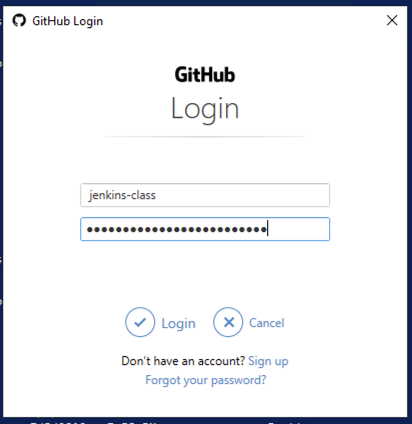
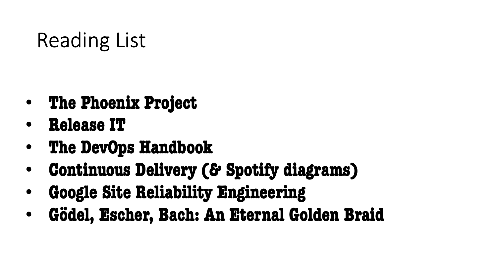

#  .Amazic Jenkins Pipeline Workshop

#### 4th July 2019

> In this free hands-on workshop you will learn how to create and run a Jenkins Declarative Pipeline using the Blue Ocean Editor. Participants will create a real-life Pipeline to build, test and deploy a Pipeline. The class ends with a quick tour of Pipeline capabilities that provide fit and finish to your Pipeline.
>
> Duration
> 4 hours
>
> Agenda
> 12:00 – 13:00: Lunch and registration
> 13:00 – 17:00: Jenkins Pipeline Workshop
>
> Facilities
> Bring your own laptop
> Lunch included


# Introduction


#### Who am I ?

- Jim Leitch

#### Who Is He ?

- Conor Wyse

#### Who is Amazic ?

Market Development

Jenkins Training !

#### Who is CloudBees ?

#### What are Objectives ?

##### Spring PetClinic Build

- Simple java monolith
- Application, webserver, database all-in-one

##### Our Repo

https://github.com/spring-projects/spring-petclinic

- Get Started and Connected To Cloud Workstation
- Quick Recap of CICD Principles
- History of Jenkins and Pipeline
- Build on Workstation
- Build on Jenkins (Tradtional - FreeStyle Job)
- Declarative Pipelines !
- [Terraform to build lab in Azure]


# Get Started and Connected To Cloud Workstation

#### RDP Workstation

- [ ] Instal MS RDP client on your laptop !

**Username:** `workshop`

**Password:** `00AB@-equation-blue-major`

| Name       | RDP Connection                              |
| ---------- | ------------------------------------------- |
| Alessandro | jws2019.westeurope.cloudapp.azure.com:50000 |
| Marcel     | jws2019.westeurope.cloudapp.azure.com:50001 |
| Arend      | jws2019.westeurope.cloudapp.azure.com:50002 |
| Johannes   | jws2019.westeurope.cloudapp.azure.com:50003 |
| Laurens    | jws2019.westeurope.cloudapp.azure.com:50004 |
| Tiemco     | jws2019.westeurope.cloudapp.azure.com:50005 |
| Arnold     | jws2019.westeurope.cloudapp.azure.com:50006 |
| John       | jws2019.westeurope.cloudapp.azure.com:50007 |
| Alex       | jws2019.westeurope.cloudapp.azure.com:50008 |
| Bas        | jws2019.westeurope.cloudapp.azure.com:50009 |
| Klaas      | jws2019.westeurope.cloudapp.azure.com:50010 |
| Mark       | jws2019.westeurope.cloudapp.azure.com:50011 |
| Jeffrey    | jws2019.westeurope.cloudapp.azure.com:50012 |
| Eric       | jws2019.westeurope.cloudapp.azure.com:50013 |
| Sander     | jws2019.westeurope.cloudapp.azure.com:50014 |
| Johan      | jws2019.westeurope.cloudapp.azure.com:50015 |


#### Installing Required Client SW

~~Copy and paste this into PowerShell~~ Has been done already

```powershell
Set-ExecutionPolicy Bypass -Scope Process -Force; iex ((New-Object System.Net.WebClient).DownloadString('https://chocolatey.org/install.ps1'))

choco install -y  jdk8
choco install -y maven
choco install -y git
choco install -y firefox
choco install -y vscode
choco install -y googlechrome
choco install -y putty
choco install -y ConEmu
```


- [ ] Check all components working


#### Jenkins Server

http://jenkins.jws2019.test-rig.net:8080/

`ssh workshop@jenkins.jws2019.test-rig.net`

**Username:** `workshop`

**Password:** `00AB@-equation-blue-major`


#### GIT Prep

- [ ]  Install GIT credentials manager

https://github.com/microsoft/Git-Credential-Manager-for-Windows/releases/download/1.18.5/GCMW-1.18.5.exe


Start `ConEmu` with Git Bash option


```bash
git clone https://github.com/jimleitch01/jenkinsworkshop2019
git config --global user.email "you@example.com"
git config --global user.name "Your Name"
cd jenkinsworkshop2019
git checkout -b YourName
```


Make a small change and and `push` results :





### Exercise 00- Connect to cloud Workstation

- [ ] Connect to Cloud Workstation using RDP client, use details in table above


# Quick Recap of CICD Principles

### Reading List



### CICD

- Fail Fast - Fix Fast - Increase developer productivity
- Faster time to market
- Small releases
- CICD Pipeline
- Code Quality, Unit Tests, Build, Component Tests
- Releases should be boring
- Repeatable releases, no effort, no stress
- Automate 100%


### Everything-as-code

- Everyone is a developer !
- Versioned
- Repeatable
- Auditable
- Steal Developer Tools
- Releases should be boring


### CICD Orchestrator

Examples:

- Azure DevOps
- GitLab
- CircleCI
- Jenkins


Why ?

- Repeatable Builds
- Logging, Audit
- Stages
  - Code Quality
  - Unit Tests
  - Build
  - API Tests
  - Integrations Tests
  - Release Process


# History of Jenkins and Jenkins Pipeline

- Hudson

- Config by clicking around

- Docker Agents

- Janky PlugIns

- Jenkins Scripted PipeLine (Groovy)

- Blue Ocean

- Jenkins Declarative PipeLine

- Serverless Jenkins

  - Cloud Native / Kubernetes JenkinsX
  - Jenkins YAML Description
  - Docker Multistage Build

  

https://jenkins.io/projects/jenkins-x/


# Build on Workstation


### Exercise 01- Local Build


- [ ] Login To Workstation
- [ ] Git pull
- [ ] Maven Build
- [ ] Java run
- [ ] See results
- [ ] Make Change
- [ ] Maven Build
- [ ] Java Run 

- [ ] See results


# Build on Jenkins (Tradtional - FreeStyle Job)


### Exercise 02 - Traditional Jenkins Build *(FreeStyle)*


- [ ] Create a Folder in Jenkins with **_YOURNAME_** 

- [ ] Create New FreeStyle job in your folder
- [ ] Connect to git repo - your branch
- [ ] Set Parameter `PETCLINICPORT`
- [ ] Build Stage
- [ ] Watch Build process
- [ ] Run petclinic on your **port** and connect from workstation

```#!/bin/bash 
#!/bin/bash

set -e
set -x

if [[ ${PETCLINICPORT} == "" ]]
then
	export petClinicPort=9090
fi


mvn test

mvn install

# java -Dserver.port=${PETCLINICPORT} -jar target/spring-petclinic-2.1.0.BUILD-SNAPSHOT.jar 
```


# Declarative Pipelines !


### Exercise 02 - My first Pipeline

Create 

Show Workflow and run thru a few times

### Exercise 03 Autocreate Job from Branch

### Exercise 04  Shell & Variables

http://jenkins.jws2019.test-rig.net:8080/env-vars.html/


### Exercise 05  Blocks

### Exercise 06  Parallel Running

### Exercise 07 Using Plugins & Snippet Editor

### Exercise 08 Blue Ocean & Editor

### Exercise 09 - Docker multistage build

### Exercise 10 Azure Container Build

###Exercise 11 Easiest Jenkins Install In The World

`sudo apt-get install default-jdk`

https://www.digitalocean.com/community/tutorials/how-to-install-jenkins-on-ubuntu-16-04

#### Jenkins PlugIns

- Azure Service Principal


