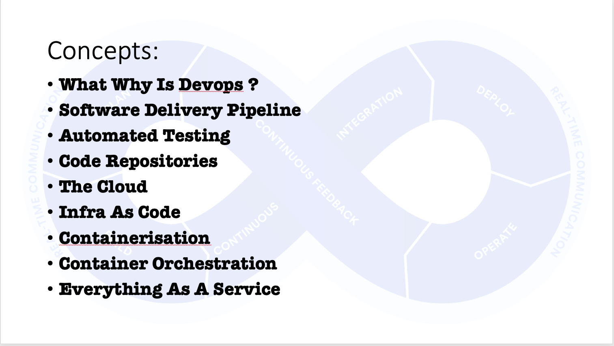
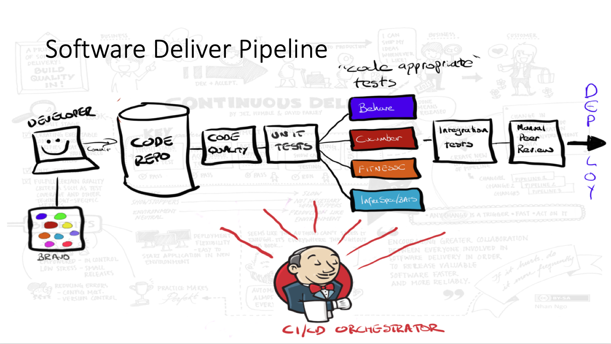

#  Amazic Jenkins Pipeline Workshop

#### 4th July 2019

> In this free hands-on workshop you will learn how to create and run a Jenkins Declarative Pipeline using the Blue Ocean Editor. Participants will create a real-life Pipeline to build, test and deploy a Pipeline. The class ends with a quick tour of Pipeline capabilities that provide fit and finish to your Pipeline.
>
> Duration
> 4 hours
>
> Agenda
> 12:00 – 13:00: Lunch and registration
> 13:00 – 17:00: Jenkins Pipeline Workshop
>
> Facilities
> Bring your own laptop
> Lunch included


# Getting Started

#### RDP Workstation

**Username:** `workshop`

**Password:** `00AB@-equation-blue-major`

| Name       | RDP Connection                              |
| ---------- | ------------------------------------------- |
| Alessandro | jws2019.westeurope.cloudapp.azure.com:50000 |
| Marcel     | jws2019.westeurope.cloudapp.azure.com:50001 |
| Arend      | jws2019.westeurope.cloudapp.azure.com:50002 |
| Johannes   | jws2019.westeurope.cloudapp.azure.com:50003 |
| Laurens    | jws2019.westeurope.cloudapp.azure.com:50004 |
| Tiemco     | jws2019.westeurope.cloudapp.azure.com:50005 |
| Arnold     | jws2019.westeurope.cloudapp.azure.com:50006 |
| John       | jws2019.westeurope.cloudapp.azure.com:50007 |
| Alex       | jws2019.westeurope.cloudapp.azure.com:50008 |
| Bas        | jws2019.westeurope.cloudapp.azure.com:50009 |
| Klaas      | jws2019.westeurope.cloudapp.azure.com:50010 |
| Mark       | jws2019.westeurope.cloudapp.azure.com:50011 |
| Jeffrey    | jws2019.westeurope.cloudapp.azure.com:50012 |
| Eric       | jws2019.westeurope.cloudapp.azure.com:50013 |
| Sander     | jws2019.westeurope.cloudapp.azure.com:50014 |
| Johan      | jws2019.westeurope.cloudapp.azure.com:50015 |


#### Installing Required Client SW

Copy and paste this into PowerShell

```powershell
Set-ExecutionPolicy Bypass -Scope Process -Force; iex ((New-Object System.Net.WebClient).DownloadString('https://chocolatey.org/install.ps1'))

choco install -y  jdk8
choco install -y maven
choco install -y git
choco install -y firefox
choco install -y vscode
choco install -y googlechrome
choco install -y putty
choco install -y ConEmu
```


Install GIT credentials manager

https://github.com/microsoft/Git-Credential-Manager-for-Windows/releases/download/1.18.5/GCMW-1.18.5.exe

  git config --global user.email "you@example.com"
  git config --global user.name "Your Name"

Small change and `push` results in:


#### Jenkins Server

http://jenkins.jws2019.test-rig.net:8080/

**Username:** `workshop`

**Password:** `00AB@-equation-blue-major`

`ssh workshop@jenkins.jws2019.test-rig.net`


git clone https://github.com/jimleitch01/jenkinsworkshop2019.git

Prep

Get connected to cloud workstation

Pull repo

Goals


PetClinic Build

Simple java monolith

Applicatrion, webserver, database all-in-one


Improvements


Documentation


Network Diagram

"Janky plugins"

What is Blue Ocean ?

Jenkins Declarative pipeline exercises


# Introduction 


Who am I

Who is Amazic

Who is CloudBees

What are objectives

History of Jenkins Pipeline


# Plan of Action


### CI/CD, Infra as Code, DevOps, GIT, Reading List

### All exercises in GIT

### Network Diagram


# DevOps Concepts

### CICD

- Fail Fast - Fix Fast - Increase developer productivity

- Faster time to market

- Small releases

- CICD Pipeline

- Code Quality, Unit Tests, Build, Component Tests

- Releases should be boring

- Repeatable releases, no effort, no stress

- Automate 100%





### XXX-as-code

- Everyone is a developer !
- Versioned
- Repeastable
- Auditable
- Releases should be boring



### Jenkins History

##### Hudson

##### Config by clicking around

Janky PlugIns

##### Jenkins Scripted PipeLine (Groovy)

##### Jenkins Declarative PipeLine

##### Jenkins YAML Description

- Cloud Native / Kubernetes JenkinsX

  

- Serverless Jenkins


##### Future Concepts

Jenkins X


#### Workstation Tools

- Chocolatey - Package manager
- jdk8 - java
- maven - java build tool
- git - scm, git client
- firefox - browser
- vscode - IDE
- googlechrome browser
- putty - ssh client
- ConEmu - niceer windows console


### Exercise 00- Connect to cloud Workstation

- [ ] Connect to Cloud Workstation using RDP client, use details in table above

### Exercise 01- Local Build


- [ ] Login To Workstation
- [ ] Git pull
- [ ] Maven Build
- [ ] Java run
- [ ] Make Change
- [ ] Maven Build
- [ ] Java Run - see result


### Exercise 02 - Traditional Jenkins Build *(FreeStyle)*

Create New FreeStyle job in your folder

Connect to git repo

Set Parameter `PETCLINICPORT`

Build Stage

```#!/bin/bash 
#!/bin/bash

set -e
set -x

if [[ ${PETCLINICPORT} == "" ]]
then
	export petClinicPort=9090
fi


mvn test

mvn install

# java -Dserver.port=${PETCLINICPORT} -jar target/spring-petclinic-2.1.0.BUILD-SNAPSHOT.jar 
```

### Exercise 03 - My first Pipeline

### Exercise X - Shell & Variables

### Exercise 04 - Blocks

### Exercise 05 - Parallel Running

### Exercise 06 - Using Plugins

### Exercise 07 - Blue Ocean & Editor

###

### Exercise 09 -Auto create Job from Branch

### Exercise 10 - Docker multistage build

### Exercise 08 -Azure Container Build

###Exercise 11 - Easiest Jenkins Install In The World:

`sudo apt-get install default-jdk`

https://www.digitalocean.com/community/tutorials/how-to-install-jenkins-on-ubuntu-16-04


- Build from WS
- Run petclinic locally
- Make a change, rebuild,  run again, 
- Build using "traditional" Jenkins
- Build using DP
- Seperate build steps
-  
- Using Blue Ocean Editor
- Using snippet generator


# Conor ToDo:


- [ ] Create Branch per person
- [ ] Install software on workstations
- [ ] Create Personal folders in Jenkins


